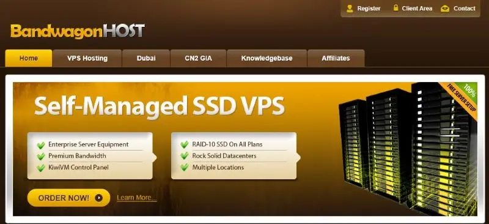

# 搬瓦工官网打不开？2025年最新访问方法来了

最近想买个海外VPS，结果搬瓦工官网怎么都打不开？别慌，这事儿我遇到过不止一次。有时候打开页面一直转圈圈，有时候直接显示DNS解析失败，还有时候干脆就是一个大大的"无法访问"。作为用了搬瓦工好几年的人，我太懂这种想买服务器却连官网都进不去的憋屈感了。

今天就来聊聊怎么顺利访问搬瓦工官网。不是那种让你折腾半天的复杂教程，就是几个实用办法，保证你能正常打开网站、买服务器、管理VPS。

---

## 为什么搬瓦工官网会打不开

搬瓦工的官方网址是 bandwagonhost.com，但在国内访问时经常出问题。具体原因主要有这么几个：

**DNS解析出了岔子**

说白了就是你的电脑问路问错了人。DNS服务器缓存出问题，或者干脆就是解析超时，结果自然找不到正确的网站地址。

**DNS污染的锅**

这个更麻烦一点。你问的路本来是对的，但半路被人指了个错方向。域名解析被劫持到错误IP，或者解析结果直接被篡改，你自然到不了正确的地方。

**网络连接被限制**

有时候不是你的问题，也不是DNS的问题，就是连接本身被拦截了。TCP连接被重置，或者请求直接被拦下来，你当然访问不了。

正因为这些原因，👉 [搬瓦工官方专门准备了好几个镜像站](https://bandwagonhost.com/aff.php?aff=79616)，就是为了让大家无论如何都能正常访问他们的服务。

---

## 怎么访问搬瓦工官网（2025年实测有效）

搬瓦工提供了多个镜像站，都是官方的备用网址，功能跟主站一模一样。我自己试过，确实好用。

**目前最稳定的访问地址**

https://bwh81.net

这个是我现在主要在用的，基本上随时都能打开，速度也不错。你可以先试试这个。

不过说实话，镜像站的访问情况确实因地区而异：

- 有些地方完全没问题，打开速度还挺快
- 有些地方可能偶尔会卡一下，但刷新就好了
- 少数地区可能真的访问不了，需要多试几个

**关于访问状态的几句实话**

镜像站能不能顺利打开，取决于好几个因素：

- 你所在地方的网络环境（这个是大头）
- 本地DNS服务器给不给力
- 网络线路质量怎么样
- 不同时间段表现也不一样，晚上高峰期可能慢一点

**我的使用建议**

1. 首选 bwh81.net 这个地址，大部分情况下都能用
2. 如果打不开，别着急，换个镜像站试试
3. 把这些镜像站地址都存到收藏夹里，方便随时切换
4. 试几个之后，记住在你那儿访问最快的那个

搬瓦工这种提供多个镜像站的做法，确实挺贴心的。毕竟买个VPS就是图个方便，要是连官网都进不去，那体验就太差了。

---

## 一些常见问题

**镜像站靠谱吗？**

完全靠谱。这些镜像站都是搬瓦工官方提供的，用的是跟官网一样的SSL证书加密。访问的时候看一眼网址前面有没有小锁标志，是HTTPS开头就没问题。

**所有镜像站都打不开怎么办？**

这种情况比较少见，但也不是没有。你可以试试：

- 切换网络环境，比如用手机流量试试
- 换个DNS服务器，比如用谷歌的8.8.8.8或者Cloudflare的1.1.1.1
- 清一下浏览器缓存，然后重新打开
- 换个时间段试试，有时候就是时段问题

**支付的时候提示错误咋办？**

支付错误一般是这几个原因：

- 网络不稳定，支付中断了
- 支付工具有限制（建议用信用卡或PayPal）
- 页面加载超时了，刷新重试就行
- 金额超出了支付工具的限制

**怎么确定访问的是官方镜像站？**

看HTTPS加密有没有，看网站界面是不是熟悉的搬瓦工风格，看支付页面跳转是不是正常。基本上只要是上面列出的镜像站地址，都是官方的。

**镜像站特别慢怎么办？**

这种情况确实存在。镜像站访问慢的话，可以多试几个镜像站，选一个在你那儿速度最快的。另外，不同时间段速度也不一样，可以错开高峰期访问。

---

## 总结

搬瓦工官网打不开的问题，说复杂也复杂，说简单也简单。关键是知道有哪些镜像站可以用，然后找到在你那儿访问最稳定的那个。

现在搬瓦工的服务确实不错，CN2 GIA线路、香港CMI、日本软银等线路都挺稳定的。如果你正在考虑购买海外VPS，👉 [不妨试试搬瓦工的服务](https://bandwagonhost.com/aff.php?aff=79616)，性价比和稳定性都在线。

希望这篇文章能帮你顺利访问搬瓦工官网，买到满意的VPS服务器。
